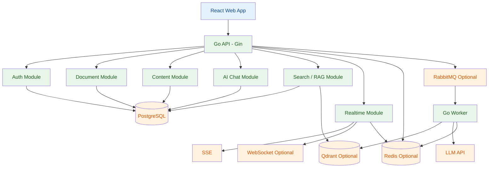
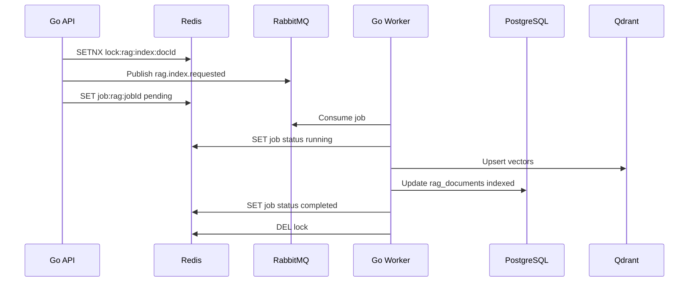
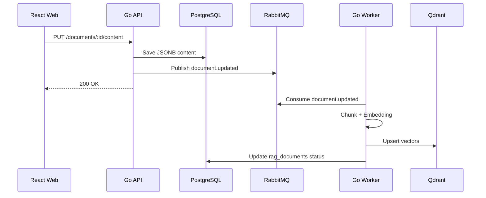

# My-Notion Go Edition 技术方案

## 1. 项目定位

`my-notion-go` 是一个完全独立于现有 My-Notion 主工程的新项目，用于从零实现一个 React + Go 技术栈的 Notion 类知识管理系统。

本项目不以兼容现有 Convex / Expo / Next.js 链路为目标，而是作为一个独立工程重新设计 Web 端、Go 后端、数据库、实时通信、异步任务、AI 与 RAG 能力。

核心目标：

1. 系统学习并实践 Go 后端工程能力。
2. 使用 React 重新实现 My-Notion Web 端核心功能。
3. 通过 monorepo 组织前端、后端、共享 SDK、部署与文档。
4. 覆盖一个相对完整的全栈项目链路：鉴权、CRUD、富文本、AI、RAG、消息队列、实时通信、部署。

非目标：

1. 不追求与当前 My-Notion 主工程无缝迁移。
2. 不复用 Convex 作为后端数据源。
3. 第一阶段不实现多人协同编辑。
4. 第一阶段不追求移动端复刻，只聚焦 Web 端完整实现。

## 2. 总体架构



架构原则：

1. 第一版采用 modular monolith，而不是微服务。
2. 后端只有 `api` 和 `worker` 两个进程，避免过早拆分。
3. 数据库选 PostgreSQL，文档正文用 JSONB。
4. AI 流式输出优先使用 SSE。
5. Redis 不作为核心持久化存储，只用于缓存、限流、短期任务状态、实时事件广播和分布式锁。
6. RabbitMQ、Redis、Qdrant、WebSocket 作为第二阶段能力逐步引入。
7. 前端通过 OpenAPI 生成的 TypeScript client 访问后端。

## 3. 技术栈

| 层 | 技术 | 说明 |
| --- | --- | --- |
| Monorepo | pnpm workspace + go work + Makefile | 统一管理 React、Go、共享包和脚本 |
| Web | React + Vite + TypeScript | 专注 SPA 和 API 调用，不依赖 Next.js |
| 路由 | TanStack Router 或 React Router | 文档页、登录页、AI 页、设置页 |
| 数据请求 | TanStack Query | 前端服务端状态管理 |
| UI | Tailwind CSS + shadcn/ui | 快速搭建类 Notion UI |
| 编辑器 | BlockNote 或 Tiptap | 富文本编辑和 block JSON 存储 |
| 状态管理 | Zustand | 主题、侧边栏、AI 配置、本地 UI 状态 |
| API 框架 | Gin | REST API、Middleware、SSE |
| ORM | GORM | PostgreSQL CRUD、事务、关联 |
| 数据库 | PostgreSQL | 用户、文档、消息、任务状态、JSONB 内容 |
| 迁移 | golang-migrate 或 goose | 数据库版本管理 |
| 鉴权 | 自研 JWT + Refresh Token | 完整学习登录态设计 |
| 实时 | SSE，后续 WebSocket | AI 流、任务状态、文档事件 |
| 缓存 / 快状态 | Redis | 限流、缓存、短期任务状态、Pub/Sub、分布式锁 |
| 队列 | RabbitMQ | 文档索引、AI 摘要、异步任务 |
| AI | OpenAI Compatible API | 普通对话、标题生成、RAG |
| 向量库 | Qdrant | 知识库问答和语义检索 |
| API 文档 | OpenAPI / Swagger | 生成 TS client |
| 部署 | Docker Compose + Fly.io / Render / Railway | 完整部署训练 |

## 4. 为什么选择 PostgreSQL

本项目主数据库推荐 PostgreSQL，而不是 MongoDB。

| 维度 | PostgreSQL | MongoDB | 结论 |
| --- | --- | --- | --- |
| Go ORM 适配 | GORM 一等支持 | 需要 MongoDB Driver | PostgreSQL 更适合 |
| 文档正文 | JSONB 可存 block JSON | BSON 原生文档模型 | MongoDB 略强 |
| 文档树 | 递归查询、path、ltree 成熟 | 需要业务侧维护结构 | PostgreSQL 更适合 |
| 事务一致性 | 强事务、外键、约束成熟 | 支持事务但建模更自由 | PostgreSQL 更适合 |
| AI 会话 | 关系表自然表达 | 可做但聚合更绕 | PostgreSQL 更适合 |
| 搜索能力 | 全文检索、JSONB 索引、pg_trgm | Atlas Search 强但依赖平台 | PostgreSQL 更稳 |
| 学习收益 | SQL、事务、索引、迁移、GORM | NoSQL 建模 | PostgreSQL 更贴合目标 |

结论：

1. My-Notion 的数据不是纯文档型，还包含用户、权限、文档树、AI 会话、任务、RAG 状态。
2. PostgreSQL 的关系模型更适合主业务库。
3. JSONB 足够承载富文本编辑器内容。
4. GORM 与 PostgreSQL 的组合更符合学习 Go 完整后端工程的目标。

## 5. Redis 使用边界

Redis 作为第二阶段引入的基础设施，主要用于学习缓存、限流、短期状态、实时广播和分布式锁。它不承载核心持久化数据，核心业务数据仍然以 PostgreSQL 为准。

适合放入 Redis 的场景：

| 场景 | Redis Key 示例 | TTL | 说明 |
| --- | --- | ---: | --- |
| 登录失败计数 | `auth:fail:{email}` | 15 分钟 | 防暴力破解 |
| Token 黑名单 | `jwt:blacklist:{jti}` | token 剩余有效期 | 退出登录或强制失效 |
| 用户文档树缓存 | `doc:tree:{userId}` | 30-120 秒 | 文档树高频读取 |
| 文档详情缓存 | `doc:detail:{userId}:{docId}` | 30-60 秒 | 热点文档短缓存 |
| AI 限流 | `rate:ai:{userId}` | 1 分钟 | 控制 LLM 调用成本 |
| RAG 索引锁 | `lock:rag:index:{docId}` | 5-10 分钟 | 防止重复向量化 |
| RAG 任务状态 | `job:rag:{jobId}` | 1 小时 | 前端展示索引进度 |
| 实时事件广播 | `pubsub:user:{userId}` | 无 | 多实例 SSE / WebSocket 广播 |

Redis 与其他组件的分工：

| 组件 | 职责 |
| --- | --- |
| PostgreSQL | 核心业务持久化，用户、文档、内容、AI 会话、任务最终状态 |
| Redis | 缓存、限流、短期任务状态、Pub/Sub、分布式锁 |
| RabbitMQ | 可靠异步任务、重试、死信队列、批量任务削峰 |
| Qdrant | 向量存储和语义检索 |

推荐引入顺序：

1. Auth 阶段：登录失败计数、token 黑名单。
2. Document 阶段：文档树缓存、热点文档缓存。
3. AI 阶段：AI 接口限流、流式任务短状态。
4. RAG 阶段：索引锁、索引任务状态。
5. Realtime 阶段：多实例 SSE / WebSocket Pub/Sub。

示例事件链路：



## 6. Monorepo 目录设计

```txt
my-notion-go/
  README.md
  package.json
  pnpm-workspace.yaml
  go.work
  Makefile
  docker-compose.yml
  .env.example

  apps/
    web/
      package.json
      vite.config.ts
      index.html
      src/
        app/
        pages/
        features/
          auth/
          documents/
          editor/
          ai-chat/
          search/
          settings/
        components/
        hooks/
        lib/
        styles/

  services/
    api/
      go.mod
      cmd/
        api/
          main.go
        worker/
          main.go
        migrate/
          main.go
      internal/
        config/
        database/
        logger/
        middleware/
        auth/
        users/
        documents/
        contents/
        chat/
        ai/
        rag/
        realtime/
        jobs/
        storage/
        response/
        errors/
      migrations/
      docs/
        openapi.yaml

  packages/
    api-client/
      package.json
      src/
        generated/
        client.ts
        hooks/
    shared/
      package.json
      src/
        types/
        constants/
        validators/

  deployments/
    docker/
    fly/
    render/

  docs/
    architecture-plan.md
    database-design.md
    api-design.md
    roadmap.md
```

## 7. 后端模块分工

| 模块 | Go 包 | 职责 |
| --- | --- | --- |
| 配置 | `internal/config` | 读取 env、数据库、JWT、AI、MQ 配置 |
| 数据库 | `internal/database` | GORM 初始化、事务封装、migration |
| 缓存 | `internal/cache` | Redis client、缓存、限流、锁、Pub/Sub |
| 日志 | `internal/logger` | 结构化日志 |
| 中间件 | `internal/middleware` | CORS、鉴权、错误恢复、请求日志 |
| 鉴权 | `internal/auth` | 注册、登录、密码 hash、JWT、refresh token |
| 用户 | `internal/users` | 用户资料、当前用户、偏好设置 |
| 文档 | `internal/documents` | 文档元信息、树结构、归档、恢复、收藏 |
| 内容 | `internal/contents` | 文档正文 JSONB、自动保存、版本号 |
| AI | `internal/ai` | LLM 调用、SSE 输出、模型配置 |
| 聊天 | `internal/chat` | 会话、消息、thinking steps |
| RAG | `internal/rag` | chunk、embedding、Qdrant 检索 |
| 实时 | `internal/realtime` | SSE/WebSocket 连接、事件推送 |
| 任务 | `internal/jobs` | RabbitMQ producer/consumer、重试、死信 |
| 存储 | `internal/storage` | 文件上传、图片元信息、对象存储适配 |
| 响应 | `internal/response` | 统一返回结构、分页、错误码 |
| 错误 | `internal/errors` | 业务错误定义和 HTTP 映射 |

## 8. 前端模块分工

| 模块 | 职责 |
| --- | --- |
| `features/auth` | 登录、注册、token 管理、路由保护 |
| `features/documents` | 文档树、文档 CRUD、回收站、收藏 |
| `features/editor` | BlockNote/Tiptap 编辑器、自动保存 |
| `features/ai-chat` | AI 对话、流式渲染、会话历史 |
| `features/search` | 文档搜索、命令菜单 |
| `features/settings` | 主题、模型、用户设置 |
| `packages/api-client` | OpenAPI 生成 client + React Query hooks |
| `packages/shared` | 跨端类型、常量、校验规则 |

## 9. 核心数据模型

| 表 | 说明 |
| --- | --- |
| `users` | 用户账号、邮箱、密码 hash |
| `refresh_tokens` | Refresh token、过期时间、设备信息 |
| `documents` | 文档元数据、树结构、归档、收藏、发布状态 |
| `document_contents` | 文档正文 JSONB、内容 hash、版本号 |
| `document_versions` | 可选，文档历史版本 |
| `ai_conversations` | AI 会话列表 |
| `ai_messages` | AI 消息，支持文本和图片 JSON |
| `ai_thinking_steps` | RAG 检索过程、工具调用过程 |
| `rag_documents` | 文档向量化状态 |
| `rag_chunks` | chunk 元数据，向量放 Qdrant |
| `jobs` | 异步任务状态 |
| `files` | 上传文件元信息 |

文档表建议：

```sql
CREATE TABLE documents (
  id UUID PRIMARY KEY,
  user_id UUID NOT NULL REFERENCES users(id),
  parent_id UUID NULL REFERENCES documents(id),
  title TEXT NOT NULL,
  icon TEXT,
  cover_image TEXT,
  is_archived BOOLEAN NOT NULL DEFAULT FALSE,
  is_starred BOOLEAN NOT NULL DEFAULT FALSE,
  is_published BOOLEAN NOT NULL DEFAULT FALSE,
  is_in_knowledge_base BOOLEAN NOT NULL DEFAULT FALSE,
  position DOUBLE PRECISION NOT NULL DEFAULT 0,
  path TEXT NOT NULL,
  created_at TIMESTAMPTZ NOT NULL,
  updated_at TIMESTAMPTZ NOT NULL,
  deleted_at TIMESTAMPTZ NULL
);

CREATE TABLE document_contents (
  document_id UUID PRIMARY KEY REFERENCES documents(id) ON DELETE CASCADE,
  content JSONB NOT NULL DEFAULT '[]'::jsonb,
  content_hash TEXT NOT NULL DEFAULT '',
  version BIGINT NOT NULL DEFAULT 1,
  updated_at TIMESTAMPTZ NOT NULL
);
```

## 10. API 设计

| API | 方法 | 用途 |
| --- | --- | --- |
| `/api/v1/auth/register` | `POST` | 注册 |
| `/api/v1/auth/login` | `POST` | 登录 |
| `/api/v1/auth/refresh` | `POST` | 刷新 token |
| `/api/v1/auth/logout` | `POST` | 退出登录 |
| `/api/v1/me` | `GET` | 当前用户 |
| `/api/v1/documents` | `POST` | 创建文档 |
| `/api/v1/documents/tree` | `GET` | 文档树 |
| `/api/v1/documents/trash` | `GET` | 回收站 |
| `/api/v1/documents/:id` | `GET` | 文档详情 |
| `/api/v1/documents/:id` | `PATCH` | 更新标题、图标、封面 |
| `/api/v1/documents/:id/content` | `PUT` | 保存正文 |
| `/api/v1/documents/:id/archive` | `POST` | 归档 |
| `/api/v1/documents/:id/restore` | `POST` | 恢复 |
| `/api/v1/documents/:id` | `DELETE` | 永久删除 |
| `/api/v1/ai/conversations` | `GET` | 会话列表 |
| `/api/v1/ai/conversations` | `POST` | 创建会话 |
| `/api/v1/ai/conversations/:id/messages` | `GET` | 获取消息 |
| `/api/v1/ai/chat/stream` | `POST` | AI SSE 对话 |
| `/api/v1/rag/documents/:id/index` | `POST` | 加入知识库 |
| `/api/v1/rag/documents/:id/index` | `DELETE` | 移出知识库 |
| `/api/v1/rag/chat/stream` | `POST` | RAG SSE 对话 |
| `/api/v1/realtime/events` | `GET` | SSE 事件流 |

## 11. 实时方案

第一阶段只做 SSE：

1. AI 流式输出使用 SSE。
2. 异步任务状态使用 SSE。
3. 文档树变化可以通过 SSE 通知前端 invalidate query。

第二阶段再引入 WebSocket：

1. 多页面文档状态同步。
2. 聊天消息实时同步。
3. 在线状态或协作提示。

暂不做多人协同编辑。多人协同编辑通常需要 Yjs / CRDT / OT，复杂度高，容易偏离 Go 后端学习主线。

事件流：



## 12. 功能范围

| 模块 | 第一版能力 | 进阶能力 |
| --- | --- | --- |
| Auth | 注册、登录、JWT、Refresh Token、退出登录 | 邮箱验证、OAuth、设备管理 |
| Documents | 创建、重命名、删除、归档、恢复、收藏 | 拖拽排序、发布分享、权限协作 |
| Editor | 富文本编辑、自动保存、JSONB 存储 | 图片、代码块、表格、版本历史 |
| Sidebar | 文档树、最近文档、搜索 | 实时刷新、批量操作 |
| AI Chat | 普通对话、SSE 流式输出、会话历史 | Agent、Tool Call、模型切换、联网搜索 |
| RAG | 文档加入知识库、向量化、基于文档问答 | 作为 Agent 的知识库 tool，支持增量更新和引用定位 |
| Realtime | AI SSE、任务状态 SSE | WebSocket 文档状态同步 |
| Files | 本地/对象存储上传图片 | S3/R2、图片压缩、权限控制 |
| Admin | 健康检查、任务列表 | 监控、审计日志 |

## 12.1 AI Agent 与 Tool 架构方向

M5 完成的 RAG 能力不应长期作为独立的“问答章节”存在，而应沉淀为 AI Agent 可自主调用的一个 tool。

长期目标：

1. AI 对话入口统一升级为 Agent 入口。
2. RAG 检索作为 `knowledge_base.search` tool，由 Agent 根据上下文自主决定是否调用。
3. 后续新增联网搜索、文档写入、任务创建、代码解释等能力时，也都以 tool 形式接入。
4. UI 层保留“知识库模式/普通模式”的轻量入口，但不在后端做大量人工 query intent 前置规则。
5. 后端保留 tool 调用过程、引用来源和 thinking steps，方便用户理解回答依据。

推荐演进路径：

1. 保留当前 `/api/v1/rag/chat/stream` 作为 RAG tool 的过渡入口，继续保证现有 smoke 和产品闭环。
2. 新增 `internal/agent` 模块，负责规划、tool registry、tool execution、stream event 编排和消息落库。
3. 把当前 RAG 检索逻辑拆成可复用的 `KnowledgeBaseSearchTool`，输入为用户问题和可选文档范围，输出为 chunks 与 citations。
4. 联网搜索后续作为 `web.search` tool 接入，避免和知识库检索耦合。
5. Agent SSE 协议需要表达 `thinking`、`tool_call`、`tool_result`、`message`、`citations`、`done`，前端再逐步展示工具调用过程。

近期不做：

1. 不做人工作 query intent 分类规则来决定是否检索知识库。
2. 不把 RAG 逻辑和联网搜索逻辑混在一个 service 内。
3. 不让 Redis 或 RabbitMQ 承载核心 tool 结果；最终可追溯状态仍落 PostgreSQL。

## 13. 学习路径

| 阶段 | 学习重点 | 目标 |
| --- | --- | --- |
| Phase 0 | Monorepo、Docker、Go 工程结构 | 项目能一键启动 |
| Phase 1 | Gin、GORM、PostgreSQL | 完成 Auth + Document CRUD |
| Phase 2 | React Query、OpenAPI、前后端联调 | 前端完整使用 Go API |
| Phase 3 | 富文本编辑器、JSONB、自动保存 | 完成 Notion 核心编辑体验 |
| Phase 4 | SSE、AI 流式输出 | 完成 AI Chat |
| Phase 5 | Redis、RabbitMQ、Worker、Qdrant | 完成缓存、限流、异步索引和 RAG 知识库 |
| Phase 6 | WebSocket/SSE 事件系统 | 替代基础实时能力 |
| Phase 7 | 部署、日志、监控、测试 | 形成完整工程闭环 |

## 14. 开发里程碑

| 里程碑 | 产出 | 预估时间 |
| --- | --- | ---: |
| M0 | monorepo + docker-compose + hello API + hello Web | 1-2 天 |
| M1 | Auth + JWT + 用户表 + 登录注册页面 | 3-5 天 |
| M2 | Document CRUD + 文档树 + React Query hooks | 5-7 天 |
| M3 | Editor + JSONB 保存 + 自动保存 | 5-7 天 |
| M4 | AI Chat + SSE + 会话历史 | 5-7 天 |
| M5 | Redis + RabbitMQ Worker + RAG 索引 + Qdrant | 7-10 天 |
| M6 | 搜索、回收站、收藏、发布页面 | 5-7 天 |
| M7 | WebSocket/SSE 事件、部署、测试 | 7-10 天 |

整体预估：

1. 可运行 MVP：2-3 周。
2. 覆盖主要 My-Notion Web 功能：5-8 周。
3. 加上 AI/RAG/Redis/RabbitMQ/WebSocket/部署：8-12 周。

## 15. 推荐最小闭环

第一版应优先完成：

1. React Web 登录注册。
2. Go JWT 鉴权。
3. PostgreSQL 文档树。
4. 富文本 JSONB 保存。
5. AI SSE 对话。
6. Docker Compose 一键启动。

完成这 6 个能力后，项目已经具备完整全栈作品的基本形态。

第二版再引入：

1. RabbitMQ 异步任务。
2. Redis 缓存、限流、任务状态和分布式锁。
3. Qdrant RAG。
4. WebSocket 实时通知。
5. OpenAPI 生成 TS client。
6. CI/CD 与部署。
7. 单元测试与集成测试。

## 16. 与现有项目的关系

现有 My-Notion 主工程继续作为当前产品实现。

`my-notion-go` 作为新的学习型全栈项目：

1. 不复用 Convex。
2. 不复用 Next.js 服务端 API。
3. 不复用 Expo 移动端。
4. 可以参考原项目的产品交互和数据概念。
5. 可以在成熟后反向沉淀经验到主工程。

这种方式的优势：

1. 没有旧链路兼容成本。
2. 可以从零设计真正的 Go 后端。
3. 项目边界清晰，适合作品集展示。
4. 现有主项目不受实验性重构影响。
5. 学习路径完整，覆盖前端、后端、数据库、缓存、队列、实时、AI、部署。
