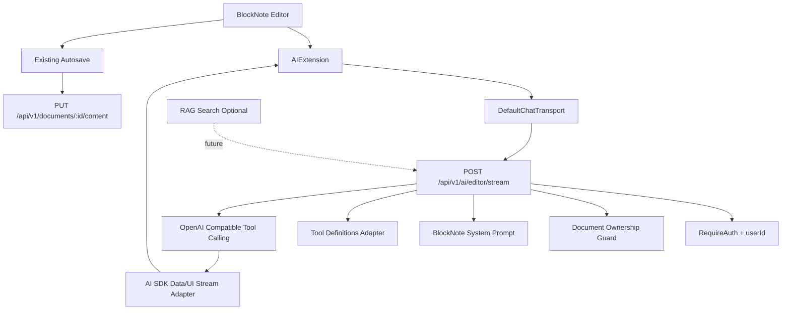

# BlockNote 编辑器原生 AI 技术方案

## 1. 背景与目标

当前 `my-notion-go` 已经完成 Web 端 BlockNote 编辑器、JSONB 自动保存、右侧 AI Chat、RAG 问答和引用定位。但 AI 能力仍然以独立侧边面板为主，用户无法在正文编辑器内直接完成选区改写、续写、插入、总结、翻译和 AI suggestion 接受/拒绝等 Notion-like 操作。

本方案基于 BlockNote 官方 AI 文档设计 Web 端编辑器原生 AI 能力：

1. 在 `apps/web` 的 BlockNote 编辑器内接入 `@blocknote/xl-ai`。
2. 通过 Formatting Toolbar 和 Slash Menu 提供原生 AI 入口。
3. 通过 `AIMenuController` 承载用户输入、思考中、写入中、用户 review、错误和关闭状态。
4. 通过 Go API 提供 BlockNote AI 专用 streaming endpoint。
5. 复用当前 OpenAI Compatible 模型配置，但不破坏已有 AI Chat/RAG 协议。
6. 保持数据隔离、自动保存、i18n、Notion-like UI 和项目工程规则。

阶段成功标准：

1. 选中文本后可以点击 AI 按钮进行改写、翻译、精简、扩写。
2. 在空白或正文中输入 `/ai` 可以生成、续写或插入内容。
3. AI 修改以 BlockNote suggestion 形式流式写入，用户可以接受或拒绝。
4. AI 写入后的正文仍能触发当前自动保存链路。
5. 当前右侧 AI Chat/RAG 面板保持可用，作为长对话和知识库问答入口。

## 2. 范围边界

### 本阶段要做

1. Web 端接入 `@blocknote/xl-ai`。
2. 新增编辑器内 AI Toolbar、Slash AI 和 AI Menu。
3. 新增编辑器 AI 专用后端接口。
4. 支持 BlockNote AI 请求中的 `messages`、`toolDefinitions` 和 document state metadata。
5. 支持 LLM tool calling，并把 tool calls 以 BlockNote AI 可消费的 stream 协议返回前端。
6. 新增常用文档编辑命令。
7. 补齐中英文文案、错误提示和验证脚本规划。

### 本阶段不做

1. 不做移动端。
2. 不替换右侧 AI Chat/RAG 面板。
3. 不把现有 `/api/v1/ai/chat/stream` 改造成 BlockNote AI 协议。
4. 不引入 Next.js API 或 Web 端直连 LLM provider。
5. 不做多人协同编辑。
6. 不做复杂 Agent、多工具规划和长期记忆。
7. 不在第一阶段强制完成 RAG tool 化，只保留后续演进接口。

## 3. 官方 BlockNote AI 接入模型

官方文档链接：

1. [AI](https://www.blocknotejs.org/docs/features/ai)
2. [Getting Started](https://www.blocknotejs.org/docs/features/ai/getting-started)
3. [Backend Integration](https://www.blocknotejs.org/docs/features/ai/backend-integration)
4. [Custom AI Commands](https://www.blocknotejs.org/docs/features/ai/custom-commands)
5. [Reference](https://www.blocknotejs.org/docs/features/ai/reference)

### 前端核心组件

| 能力 | 官方 API | 说明 |
| --- | --- | --- |
| AI 扩展注册 | `AIExtension` | 在 `useCreateBlockNote` 的 `extensions` 中注册 |
| 请求后端 | `DefaultChatTransport` | 使用 AI SDK transport 向后端发送请求 |
| AI 菜单 | `AIMenuController` | 展示用户输入、思考、写入、review、错误状态 |
| 选区入口 | `AIToolbarButton` | 加入 Formatting Toolbar |
| Slash 入口 | `getAISlashMenuItems` | 合并到 `/` Suggestion Menu |
| 默认命令 | `getDefaultAIMenuItems` | 保留官方默认菜单项 |
| 自定义命令 | `AIMenuSuggestionItem` | 使用 `invokeAI` 调用指定 prompt |
| 编辑权限限制 | `aiDocumentFormats.html.getStreamToolsProvider` | 控制本次调用允许 add/update/delete |

### 后端核心要求

官方推荐后端使用 Vercel AI SDK：

1. 从请求体读取 `messages` 和 `toolDefinitions`。
2. 使用 `injectDocumentStateMessages(messages)` 把 BlockNote document state 注入模型消息。
3. 使用 `toolDefinitionsToToolSet(toolDefinitions)` 把前端 tool definitions 转成 LLM tools。
4. 使用 `aiDocumentFormats.html.systemPrompt` 或兼容 prompt，告诉模型如何修改 BlockNote 文档。
5. 返回 `result.toUIMessageStreamResponse()`，即 AI SDK UI Message Stream。

本项目后端是 Go，因此不能直接使用官方 JS helper。需要在 Go API 中实现兼容层：

1. 接收与校验 BlockNote AI 请求体。
2. 提取 message 文本、metadata 中的 document state 和 tool definitions。
3. 组装 OpenAI Compatible tool calling 请求。
4. 流式解析模型返回的 content/tool calls。
5. 按 AI SDK Data/UI Stream Protocol 输出给 BlockNote AI 前端。

## 4. 当前工程现状

### 已有 Web 编辑器

文件：`apps/web/src/features/documents/DocumentEditor.tsx`

当前能力：

1. 读取 `GET /api/v1/documents/:id/content`。
2. 使用 `useCreateBlockNote` 初始化编辑器。
3. 使用 `BlockNoteView` 渲染正文。
4. 通过 `useAutosaveDocumentContent` 做 900ms 防抖保存。
5. 切换文档时通过 `key={documentId}` 重新挂载。
6. React Query 拿到远端新版本后使用 `editor.replaceBlocks` 同步内容。
7. 支持 RAG citation 高亮和滚动定位。

当前缺口：

1. 未安装 `@blocknote/xl-ai` 和 `ai`。
2. 未注册 `AIExtension`。
3. 未自定义 Formatting Toolbar 和 Slash Menu。
4. 未提供 BlockNote AI 专用后端 endpoint。

### 已有 AI 与 RAG

后端入口：

1. `POST /api/v1/ai/chat/stream`
2. `POST /api/v1/rag/chat/stream`

当前协议：

1. 自定义 SSE event，包括 `conversation`、`user_message`、`message`、`citations`、`assistant_message`、`done`、`error`。
2. 适合右侧 AI Chat/RAG 面板。
3. 不兼容 BlockNote AI 的 AI SDK Data/UI Stream。

结论：

1. 不复用现有 endpoint 承载 BlockNote AI。
2. 新增 `POST /api/v1/ai/editor/stream`，隔离协议风险。
3. 底层可复用模型配置、OpenAI Compatible client、鉴权中间件和后续 RAG 检索能力。

## 5. 总体架构



设计原则：

1. 编辑器 AI endpoint 是独立协议适配层，不污染已有 Chat/RAG。
2. 用户身份来自 JWT，不信任前端传入的 `userId`。
3. 如果请求携带 `documentId`，后端必须校验当前用户拥有该文档。
4. BlockNote AI 产生的正文变更由前端编辑器应用，再通过现有 autosave 落库。
5. 后端不直接写 `document_contents`，避免与编辑器本地 suggestion review 状态冲突。

## 6. 前端设计

### 依赖

在 `apps/web/package.json` 增加：

```json
{
  "dependencies": {
    "@blocknote/xl-ai": "0.49.0",
    "ai": "^6.0.0"
  }
}
```

说明：

1. `@blocknote/xl-ai` 版本与现有 BlockNote 生态保持 `0.49.0`。
2. `ai` 提供 `DefaultChatTransport`。
3. 继续保留根 `package.json` 中的 `prosemirror-model: 1.25.4` override。
4. `@blocknote/xl-ai` 属于 open source copyleft package，闭源或商业场景需要确认许可证或 Business subscription。

### 入口改造

改造文件：

1. `apps/web/src/features/documents/DocumentEditor.tsx`
2. `apps/web/src/features/documents/editor-ai/EditorAIMenuController.tsx`
3. `apps/web/src/features/documents/editor-ai/EditorAIFormattingToolbar.tsx`
4. `apps/web/src/features/documents/editor-ai/EditorAISlashMenu.tsx`
5. `apps/web/src/features/documents/editor-ai/editorAICommands.tsx`
6. `apps/web/src/features/documents/editor-ai/editorAITransport.ts`

建议拆分原因：

1. `DocumentEditor.tsx` 已承担内容加载、同步、自动保存和 citation 高亮，不应继续膨胀。
2. AI menu、toolbar、slash menu、commands、transport 是独立可测试单元。
3. 后续若需要在只读页面禁用 AI，可通过组件边界控制。

### 编辑器初始化

`BlockNoteEditorSurface` 中的 `useCreateBlockNote` 增加：

1. `dictionary.ai`：从 `@blocknote/xl-ai/locales` 选择 `zh` / `en`。
2. `extensions`：注册 `AIExtension`。
3. `transport`：使用 `DefaultChatTransport`。
4. `chatRequestOptions` 或 transport body：透传 `documentId`、`model` 等业务字段。

示意：

```tsx
const editor = useCreateBlockNote({
  dictionary: createBlockNoteDictionary(i18n.language, t("editor.placeholder")),
  extensions: [
    AIExtension({
      transport: createEditorAITransport({ accessToken, documentId, model }),
      agentCursor: { name: "AI", color: "#8bc6ff" },
    }),
  ],
  initialContent,
}, [blockNoteDictionary, accessToken, documentId, model]);
```

注意：

1. `accessToken` 更新时 transport 必须使用最新 token。
2. AI request 是流式请求，不能复用当前 JSON envelope `request()`。
3. 需要为鉴权头、stream 协议和错误降级写注释。

### Formatting Toolbar

目标：

1. 选中文本后展示常规格式按钮。
2. 在常规按钮后加入 `AIToolbarButton`。
3. 保持原 BlockNote 默认交互，不重写整套 UI。

实现：

1. `BlockNoteView` 设置 `formattingToolbar={false}`。
2. 子节点加入 `FormattingToolbarController`。
3. `formattingToolbar` 使用自定义组件：

```tsx
<FormattingToolbar>
  {...getFormattingToolbarItems()}
  <AIToolbarButton />
</FormattingToolbar>
```

### Slash Menu

目标：

1. 输入 `/` 后保留默认 BlockNote slash items。
2. 追加官方 AI slash items。
3. 后续可追加项目自定义生成命令。

实现：

1. `BlockNoteView` 设置 `slashMenu={false}`。
2. 子节点加入 `SuggestionMenuController`。
3. `getItems` 使用 `filterSuggestionItems` 过滤：

```tsx
[
  ...getDefaultReactSlashMenuItems(editor),
  ...getAISlashMenuItems(editor),
]
```

### AI Menu

目标：

1. 保留官方默认 AI Menu。
2. 在 `user-input` 状态按选区状态追加项目自定义命令。
3. 非 `user-input` 状态返回官方默认 items，避免破坏 thinking/writing/review/error UI。

规则：

1. 有选区：追加翻译、改善写作、精简、扩写、总结选区。
2. 无选区：追加继续写作、生成大纲、总结上方内容。
3. 每个命令通过 `editor.getExtension(AIExtension)?.invokeAI()` 发起。
4. 修改选区类命令默认只允许 `update`。
5. 插入/生成类命令默认只允许 `add`。
6. 谨慎允许 `delete`，默认禁用。

### i18n

新增资源位置：

1. `apps/web/src/i18n/resources.ts`

新增 key 建议：

1. `editorAI.commands.translateToChinese`
2. `editorAI.commands.translateToEnglish`
3. `editorAI.commands.improveWriting`
4. `editorAI.commands.shorten`
5. `editorAI.commands.expand`
6. `editorAI.commands.continueWriting`
7. `editorAI.commands.generateOutline`
8. `editorAI.commands.summarizeSelection`
9. `editorAI.commands.summarizeAbove`
10. `editorAI.errors.streamFailed`
11. `editorAI.errors.authRequired`

要求：

1. 所有用户可见文案必须同时维护 `zh` 和 `en`。
2. AI prompt 可以使用英文或中英混合，但菜单标题、错误提示和空态必须 i18n。

## 7. 后端设计

### 新增模块

建议新增：

```txt
services/api/internal/editorai/
  models.go
  service.go
  handler.go
  stream.go
  tools.go
  prompt.go
```

职责：

| 文件 | 职责 |
| --- | --- |
| `models.go` | BlockNote AI 请求体、消息、tool definitions、stream event DTO |
| `handler.go` | Gin handler、鉴权上下文读取、请求解析、SSE header |
| `service.go` | 文档归属校验、prompt 编排、LLM 调用编排 |
| `stream.go` | AI SDK Data/UI Stream 兼容输出 |
| `tools.go` | tool definitions 到 OpenAI-compatible tools 的转换 |
| `prompt.go` | BlockNote 编辑器 AI system prompt |

### 新增路由

在 `services/api/cmd/api/main.go` 的受保护 AI routes 下新增：

```go
aiRoutes.POST("/editor/stream", editorAIHandler.StreamEditorAI)
```

接口：

| API | 方法 | 用途 |
| --- | --- | --- |
| `/api/v1/ai/editor/stream` | `POST` | BlockNote 编辑器内 AI 流式改写/生成 |

请求体最小结构：

```json
{
  "messages": [],
  "toolDefinitions": [],
  "documentId": "optional-document-uuid",
  "model": "deepseek-v4-pro"
}
```

说明：

1. `messages` 和 `toolDefinitions` 来自 BlockNote AI / AI SDK。
2. `documentId` 和 `model` 是项目业务字段，由 transport 追加。
3. 后端只信任 JWT 中的 `userId`。
4. 如果 `documentId` 非空，必须通过 documents repository 校验文档归属。

### LLM 调用

当前 `internal/ai/client.go` 仅支持文本 delta。M9 需要新增或扩展支持：

1. OpenAI-compatible tool definitions。
2. Streaming tool calls。
3. `tool_choice`。
4. tool call id、name、arguments 的增量拼接。
5. content delta 与 tool call delta 的统一回调。

建议不要直接破坏当前 `StreamChat`：

1. 保留 `StreamChat` 服务现有 AI Chat/RAG。
2. 新增 `StreamToolChat` 或 `StreamEditorAI` 方法。
3. 测试覆盖文本 delta 和 tool call delta。

## 8. Stream 协议设计

BlockNote AI 默认消费 AI SDK Data/UI Stream Protocol。本项目 Go 后端需要输出兼容 SSE。

设计目标：

1. 前端继续使用 `DefaultChatTransport`，不写自定义 transport。
2. 后端响应 header 与 AI SDK stream 兼容。
3. tool calls 能被 BlockNote AI 自动应用到编辑器。
4. 错误能进入 AI menu error 状态，而不是静默失败。

实现策略：

1. 第一阶段优先对齐 BlockNote AI 实际需要的最小 UI Message Stream event。
2. 用集成测试固定当前 `@blocknote/xl-ai@0.49.0` 可消费的输出格式。
3. 如果 Go 端完整兼容成本过高，再评估前端自定义 transport，但不作为首选方案。

风险：

1. Vercel AI SDK stream protocol 版本可能随 `ai` 包升级变化。
2. `@blocknote/xl-ai` 仍处 early preview，接口可能变动。
3. Go 后端缺少官方 helper，需要更强的测试保护。

缓解：

1. 固定 `@blocknote/xl-ai` 和 `ai` 的版本范围。
2. 在 M9 smoke 中使用真实 BlockNote AI 请求样本。
3. 后端单测覆盖 stream frame 格式。
4. 文档标注协议适配层为高风险区域。

## 9. 自定义命令设计

### 命令清单

| 命令 | 入口 | 使用选区 | 允许工具 | Prompt 方向 |
| --- | --- | --- | --- | --- |
| 翻译为中文 | Toolbar AI | 是 | `update` | 将选中文本翻译为自然中文 |
| 翻译为英文 | Toolbar AI | 是 | `update` | 将选中文本翻译为自然英文 |
| 改善写作 | Toolbar AI | 是 | `update` | 保留原意，提升表达清晰度 |
| 精简 | Toolbar AI | 是 | `update` | 压缩冗余表达 |
| 扩写 | Toolbar AI | 是 | `update` | 增加解释与细节 |
| 总结选区 | Toolbar AI | 是 | `update` 或 `add` | 生成选区摘要 |
| 继续写作 | Slash AI | 否 | `add` | 根据当前上下文续写 |
| 生成大纲 | Slash AI | 否 | `add` | 插入结构化大纲 |
| 总结上方内容 | Slash AI | 否 | `add` | 总结当前光标之前内容 |

### 操作限制

默认限制：

1. 改写类命令只允许 `update`。
2. 插入类命令只允许 `add`。
3. 默认不允许 `delete`。
4. 只有未来明确需要“删除冗余段落”时再开放 `delete`。

示意：

```ts
aiDocumentFormats.html.getStreamToolsProvider({
  defaultStreamTools: {
    add: false,
    delete: false,
    update: true,
  },
})
```

## 10. 与现有 AI Chat/RAG 的关系

### 边界

| 模块 | 定位 | 协议 | UI |
| --- | --- | --- | --- |
| Editor AI | 编辑器内改写/生成/插入 | AI SDK Data/UI Stream | BlockNote AI Menu |
| AI Chat | 通用长对话 | 当前自定义 SSE | 右侧 AI Chat Panel |
| RAG Chat | 知识库问答和引用 | 当前自定义 SSE + citations | 右侧 AI Chat Panel |

### 复用

可复用：

1. 模型白名单。
2. OpenAI Compatible 基础配置。
3. JWT 鉴权。
4. 文档归属校验。
5. 后续 RAG 检索 service。

不复用：

1. 不复用当前 Chat SSE 事件协议。
2. 不复用当前 AI Chat 前端 hook。
3. 不复用当前 RAG citation UI 作为 editor AI suggestion UI。

### 后续 RAG 增强

M9 后续可以把 RAG 作为 editor AI 的增强上下文：

1. 用户在文档内提问时，后端根据 `documentId` 检索当前文档或知识库 chunks。
2. 把检索结果作为 system/context message 注入 LLM。
3. 不在第一阶段让 LLM 自主调用 `knowledge_base.search` tool。
4. 等 Agent 架构成熟后，再把 RAG 变成显式 tool。

## 11. 数据与权限边界

安全规则：

1. `POST /api/v1/ai/editor/stream` 必须挂在 `RequireAuth` 后。
2. `userId` 只来自 JWT，不从请求体读取。
3. 请求携带 `documentId` 时，必须校验 `documents.user_id = userId`。
4. 后端不得允许跨用户读取 document content 或 RAG chunks。
5. 前端不得把模型 API key 暴露到浏览器。
6. BlockNote tool definitions 来自前端，但后端仍需限制可接受字段大小和 JSON 深度，避免异常请求放大。

持久化规则：

1. Editor AI 不直接写数据库正文。
2. AI suggestion 被用户接受后，由 BlockNote 修改本地 editor document。
3. 当前 `onChange` 自动保存会把最终正文保存到 `document_contents.content`。
4. 如果用户拒绝 AI suggestion，不产生正文保存。

## 12. 错误处理与降级

前端错误：

1. 401：提示用户重新登录或刷新 token。
2. 403/404：提示当前文档不可访问。
3. 429：提示 AI 请求过于频繁。
4. 5xx：展示 AI menu error 状态，允许 retry。
5. 用户切换文档或卸载组件：abort 当前 stream。

后端错误：

1. 请求体非法：返回 400。
2. 未登录：返回 401。
3. 文档不属于当前用户：返回 404 或 403，避免泄露存在性。
4. 模型不可用：返回 stream error frame。
5. LLM stream 中断：结束 SSE 并输出错误 frame。

降级策略：

1. 未配置 `LLM_API_KEY` 时，可以提供 mock stream 用于本地 UI 调试。
2. mock 需要能覆盖 AI menu 状态，但不必真的生成复杂 tool calls。
3. 如果 tool calling 不可用，应禁用 editor AI 写入入口，而不是退化成纯文本插入。

## 13. 测试与验收

### 后端测试

建议新增：

1. `services/api/internal/editorai/stream_test.go`
2. `services/api/internal/editorai/tools_test.go`
3. `services/api/internal/ai/tool_client_test.go`

覆盖：

1. 请求体解析。
2. 文档归属校验。
3. tool definitions 转换。
4. OpenAI-compatible tool call delta 拼接。
5. AI SDK stream frame 输出。
6. 下游 writer 失败时中断上游读取。

### Smoke

建议新增：

1. `services/api/docs/editor-ai.http`
2. `scripts/smoke-editor-ai-api.mjs`
3. 根 `package.json` 增加 `pnpm smoke:api:editor-ai`

Smoke 覆盖：

1. 登录获取 token。
2. 创建文档并写入 BlockNote JSON。
3. 调用 `/api/v1/ai/editor/stream`。
4. 请求体包含最小 `messages` 和 `toolDefinitions`。
5. 校验返回是 stream。
6. 校验至少包含可被前端消费的 tool call 或 mock frame。

### 前端验证

命令：

```bash
pnpm --filter @my-notion-go/web typecheck
pnpm --filter @my-notion-go/web build
```

浏览器手动验收：

1. 进入文档详情页。
2. 选中文本后出现 AI toolbar button。
3. 点击 AI button 后出现 AI menu。
4. 执行“改善写作”，可以看到流式 suggestion。
5. 接受 suggestion 后正文发生变化并触发保存。
6. 拒绝 suggestion 后正文回到原状态。
7. 输入 `/ai` 能看到 AI slash item。
8. 切换文档时当前 AI 请求被取消，不污染下一篇文档。

## 14. 分阶段实施计划

### M9.0 文档与依赖确认

1. 确认 `@blocknote/xl-ai@0.49.0` 与现有 BlockNote 包兼容。
2. 确认 `ai` 包版本和 `DefaultChatTransport` API。
3. 确认许可证边界。
4. 固定依赖版本，避免协议漂移。

### M9.1 前端基础接入

1. 安装 `@blocknote/xl-ai` 和 `ai`。
2. 在 `DocumentEditor.tsx` 注册 `AIExtension`。
3. 新增 AI formatting toolbar。
4. 新增 AI slash menu。
5. 接入 `AIMenuController`。
6. 补齐 `zh/en` 文案。

### M9.2 Go 后端 editor AI endpoint

1. 新增 `internal/editorai` 模块。
2. 新增 `POST /api/v1/ai/editor/stream`。
3. 校验 JWT 和文档归属。
4. 支持 BlockNote AI 请求体。
5. 支持 OpenAI-compatible tool calling。
6. 输出 AI SDK Data/UI Stream 兼容响应。

### M9.3 自定义命令

1. 实现翻译中文/英文。
2. 实现改善写作、精简、扩写。
3. 实现继续写作、生成大纲、总结上方内容。
4. 根据选区状态显示不同命令。
5. 为不同命令限制 add/update/delete 权限。

### M9.4 RAG/上下文增强规划

1. 保留 `documentId` 透传。
2. 后端可选择读取当前文档标题和轻量上下文。
3. 后续把 RAG 检索结果注入 editor AI system/context message。
4. 暂不把 RAG 作为 LLM tool 暴露给模型。

### M9.5 验证与体验收口

1. 补后端单测。
2. 补 smoke。
3. 跑 Web typecheck/build。
4. 跑 Go tests。
5. 手动验证 accept/reject、自动保存、取消请求、切换文档。
6. 检查 raw interactive controls、硬编码文案和大段 global CSS。

