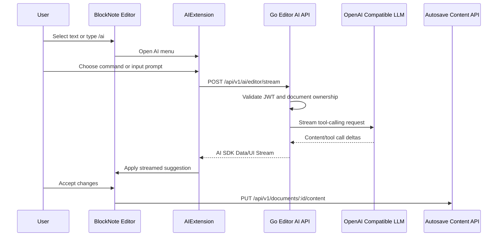

# M9 BlockNote Editor Native AI

## 阶段目标

在 Web 端 BlockNote 编辑器内原生嵌入 AI 能力，让用户可以直接在正文里完成选区改写、翻译、精简、扩写、续写、插入大纲和总结等操作。

M9 的核心目标不是新增一个独立 AI 面板，而是把 AI 变成编辑器本身的一部分：

1. 选中文本后通过 Formatting Toolbar 打开 AI。
2. 输入 `/ai` 后通过 Slash Menu 打开 AI。
3. AI 以 BlockNote suggestion 的方式流式写入。
4. 用户可以接受或拒绝 AI 修改。
5. 接受后的内容继续走现有自动保存链路。
6. 右侧 AI Chat/RAG 面板继续保留，用于长对话、知识库问答和引用展示。

完整技术方案见：

- `docs/blocknote-editor-native-ai.md`

## 范围边界

### 必须完成

- Web 端 `apps/web` 接入 `@blocknote/xl-ai`。
- `DocumentEditor` 注册 `AIExtension`。
- 新增 AI Formatting Toolbar 入口。
- 新增 AI Slash Menu 入口。
- 新增 `AIMenuController`，支持用户输入、思考、写入、review、错误状态。
- 新增项目自定义 AI 命令。
- 新增 Go API editor AI streaming endpoint：
  - `POST /api/v1/ai/editor/stream`
- 后端支持 BlockNote AI 请求体：
  - `messages`
  - `toolDefinitions`
  - `documentId`
  - `model`
- 后端校验 JWT 和文档归属。
- 后端输出 BlockNote AI 可消费的 AI SDK Data/UI Stream 兼容响应。
- 补齐 `zh/en` 文案。
- 补齐 smoke 和单测规划。

### 暂不做

- 不做移动端。
- 不替换右侧 AI Chat/RAG 面板。
- 不改造现有 `/api/v1/ai/chat/stream` 协议。
- 不改造现有 `/api/v1/rag/chat/stream` 协议。
- 不引入 Next.js API。
- 不让 Web 端直连 LLM provider。
- 不做多人协同编辑。
- 不在第一阶段做复杂 Agent 和多工具规划。
- 不在第一阶段强制把 RAG 暴露成 LLM tool。

## 官方文档结论

BlockNote AI 由 `@blocknote/xl-ai` 提供，目前仍处于 early preview。它适合实现编辑器内 AI agent，与普通聊天面板不同，它关注“直接修改文档”。

核心官方 API：

| 能力 | API | 用途 |
| --- | --- | --- |
| 注册 AI 扩展 | `AIExtension` | 挂到 `useCreateBlockNote` 的 `extensions` |
| 请求传输 | `DefaultChatTransport` | 将请求发送到后端 AI endpoint |
| AI 菜单 | `AIMenuController` | 管理 prompt、thinking、writing、review、error |
| 选区按钮 | `AIToolbarButton` | 选中文本后的 AI 入口 |
| Slash 入口 | `getAISlashMenuItems` | `/` 菜单中的 AI 入口 |
| 默认 AI 命令 | `getDefaultAIMenuItems` | 官方默认 AI menu items |
| 自定义命令 | `AIMenuSuggestionItem` | 项目自定义 prompt 和工具权限 |
| 工具限制 | `aiDocumentFormats.html.getStreamToolsProvider` | 控制 add/update/delete |

后端集成要点：

- BlockNote AI 默认期望后端响应 Vercel AI SDK Data/UI Stream。
- 请求体包含 `messages` 和 `toolDefinitions`。
- `messages` metadata 中包含 BlockNote document state，包括 selection、cursor、block IDs。
- LLM 需要收到 BlockNote tools，并通过 tool calling 让前端执行文档修改。
- 官方 JS 后端可用 `injectDocumentStateMessages`、`toolDefinitionsToToolSet` 和 `streamText`。
- 本项目后端是 Go，因此需要实现自己的协议兼容层。

## 当前工程基础

### 已有编辑器能力

- `apps/web/src/features/documents/DocumentEditor.tsx` 已完成 BlockNote 编辑器接入。
- 正文从 `document_contents.content` JSONB 读取。
- 自动保存使用 `useAutosaveDocumentContent` 和 900ms 防抖。
- 切换文档时通过 `key={documentId}` 重新挂载编辑器。
- 远端内容更新时通过 `editor.replaceBlocks` 同步。
- RAG citation 支持滚动定位和高亮。

### 已有 AI 能力

- `POST /api/v1/ai/chat/stream` 支持普通 AI Chat SSE。
- `POST /api/v1/rag/chat/stream` 支持 RAG Chat SSE 和 citations。
- `internal/ai/client.go` 支持 OpenAI Compatible 文本 delta 解析。
- 模型白名单和前端模型选择已存在。

### 当前缺口

- `apps/web/package.json` 尚未安装 `@blocknote/xl-ai` 和 `ai`。
- `DocumentEditor` 尚未注册 `AIExtension`。
- 当前 `BlockNoteView` 使用默认 toolbar 和 slash menu，没有 AI 入口。
- 当前 Go AI client 未支持 tool calling。
- 当前 SSE 协议不是 AI SDK Data/UI Stream，不能直接给 BlockNote AI 使用。

## 总体设计



关键原则：

- Editor AI 独立于 Chat/RAG 协议。
- 后端不直接写正文内容。
- 文档最终落库仍由前端自动保存完成。
- AI 写入必须经过用户 review。
- 用户身份和文档归属由 Go API 校验。

## 推荐实现顺序

### M9.0 文档与依赖确认

- 确认 `@blocknote/xl-ai@0.49.0` 与当前 BlockNote 版本一致。
- 确认 `ai` 包中的 `DefaultChatTransport` API。
- 在技术方案中记录许可证风险：
  - `@blocknote/xl-ai` 是 open source copyleft package。
  - 闭源/商业使用需确认 Business subscription 或许可证边界。
- 固定依赖版本，减少 AI SDK stream protocol 漂移。

### M9.1 前端基础接入

- 安装：
  - `@blocknote/xl-ai`
  - `ai`
- 在 `DocumentEditor.tsx` 中引入 AI dictionary。
- 创建 `editor-ai` 子目录：
  - `EditorAIMenuController.tsx`
  - `EditorAIFormattingToolbar.tsx`
  - `EditorAISlashMenu.tsx`
  - `editorAICommands.tsx`
  - `editorAITransport.ts`
- 在 `useCreateBlockNote` 中注册 `AIExtension`。
- 使用 `DefaultChatTransport` 指向 `/api/v1/ai/editor/stream`。
- `BlockNoteView` 禁用默认 toolbar 和 slash menu，并挂载自定义 AI 入口。
- 补齐 `resources.ts` 的 `zh/en` 文案。

### M9.2 Go 后端 Editor AI Endpoint

- 新增模块：

```txt
services/api/internal/editorai/
  models.go
  handler.go
  service.go
  stream.go
  tools.go
  prompt.go
```

- 注册受保护路由：

```txt
POST /api/v1/ai/editor/stream
```

- 请求处理：
  - 读取 JWT 中的 `userId`。
  - 解析 `messages`、`toolDefinitions`、`documentId`、`model`。
  - 如果有 `documentId`，校验文档属于当前用户。
  - 将 BlockNote tool definitions 转换为 OpenAI-compatible tools。
  - 注入 BlockNote 编辑器 system prompt。
  - 调用支持 tool calling 的 LLM stream。
  - 返回 AI SDK Data/UI Stream 兼容响应。

- 注意不要破坏：
  - `POST /api/v1/ai/chat/stream`
  - `POST /api/v1/rag/chat/stream`

### M9.3 自定义 AI 命令

优先实现与 Notion AI 体感接近的命令：

| 命令 | 出现场景 | 工具权限 |
| --- | --- | --- |
| 翻译为中文 | 有选区 | `update` |
| 翻译为英文 | 有选区 | `update` |
| 改善写作 | 有选区 | `update` |
| 精简 | 有选区 | `update` |
| 扩写 | 有选区 | `update` |
| 总结选区 | 有选区 | `update` 或 `add` |
| 继续写作 | 无选区或 Slash | `add` |
| 生成大纲 | 无选区或 Slash | `add` |
| 总结上方内容 | 无选区或 Slash | `add` |

默认策略：

- 改写类命令只允许 `update`。
- 生成类命令只允许 `add`。
- 默认不允许 `delete`。
- 非 `user-input` 状态返回官方默认 items，避免破坏 AI Menu 状态机。

### M9.4 上下文与 RAG 增强

第一阶段只保留接口，不强制完成：

- 前端 transport 透传 `documentId`。
- 后端可读取当前文档标题作为轻量上下文。
- 后续可把当前文档或知识库 RAG chunks 注入 system/context message。
- 等 Agent 架构成熟后，再把 `knowledge_base.search` 暴露为 editor AI tool。

### M9.5 验证与体验收口

- 补后端单测：
  - 请求解析。
  - 文档归属校验。
  - tool definitions 转换。
  - tool call delta 拼接。
  - stream frame 输出。
- 补手测文件：
  - `services/api/docs/editor-ai.http`
- 补 smoke：
  - `scripts/smoke-editor-ai-api.mjs`
  - `pnpm smoke:api:editor-ai`
- 跑验证命令。
- 手动验证浏览器体感。

## 前端能力

### `DocumentEditor` 改造

- 继续保留当前内容加载、同步、自动保存和 citation 高亮逻辑。
- 只在可编辑 `BlockNoteEditorSurface` 中启用 AI。
- `ReadonlyDocumentContent` 不启用 AI。
- AI stream 请求必须随组件卸载或文档切换 abort。
- AI 修改被接受后由 `onChange` 触发 `autosave.scheduleSave(editor.document)`。

### UI 规范

- 新增样式优先使用 Tailwind。
- 不新增大段 feature global CSS。
- 缺少 UI primitive 时先补 `components/ui` 本地封装。
- 用户可见文案必须进入 `resources.ts`。
- 对 stream、abort、transport、工具权限等非显然逻辑写简洁注释。

## 后端能力

### 权限边界

- 所有请求必须经过 `RequireAuth`。
- 不信任请求体中的用户信息。
- 文档查询必须包含 `userId`。
- 对不存在或不属于当前用户的文档返回 404 或 403，避免泄露资源存在性。

### 协议边界

- Editor AI endpoint 使用 AI SDK Data/UI Stream 兼容协议。
- AI Chat/RAG endpoint 继续使用当前自定义 SSE 协议。
- 两套协议不要混用。
- 如果 AI SDK 协议适配成本过高，再评估自定义 transport，但不作为首选方案。

### Mock fallback

- 未配置 `LLM_API_KEY` 时允许 mock，用于本地 UI 调试。
- mock 应覆盖 AI Menu 状态流转。
- mock 不应伪装成完整生产可用 tool calling。

## 风险与对策

| 风险 | 影响 | 对策 |
| --- | --- | --- |
| `@blocknote/xl-ai` early preview | API 可能变化 | 固定版本，新增 smoke |
| AI SDK Data/UI Stream 协议复杂 | Go 端适配成本高 | 最小兼容、测试固定、必要时自定义 transport |
| tool calling 解析复杂 | AI suggestion 无法应用 | 单测覆盖 tool call delta 拼接 |
| 自动保存与 AI 写入冲突 | 内容丢失或误保存 | 只在用户接受后依赖 editor onChange 保存 |
| 文档权限遗漏 | 跨用户数据泄露 | service 层统一 userId + documentId 校验 |
| 许可证不明确 | 商业/闭源风险 | 实施前确认 `@blocknote/xl-ai` 许可边界 |

## 验证

### 必跑命令

```bash
pnpm --filter @my-notion-go/web typecheck
pnpm --filter @my-notion-go/web build
go test ./services/api/...
pnpm build:api
```

### 新增后建议命令

```bash
pnpm smoke:api:editor-ai
```

### 手动验收

- 打开 Web 文档详情页。
- 选中文本后可以看到 AI 按钮。
- 点击 AI 按钮后出现 AI menu。
- 执行“改善写作”后出现流式 suggestion。
- 接受 suggestion 后正文变化并自动保存。
- 拒绝 suggestion 后正文恢复。
- 输入 `/ai` 后出现 AI slash item。
- 切换文档时当前 AI 请求不会污染下一篇文档。
- 右侧 AI Chat/RAG 面板仍可正常使用。

## 后续

M9 完成后，项目 AI 能力会形成两个清晰入口：

1. 编辑器内 AI：面向写作、改写、插入和结构化编辑。
2. 右侧 AI Chat/RAG：面向长对话、知识库问答和引用追踪。

下一阶段可以继续演进：

1. 将 RAG 检索作为 editor AI 的上下文增强。
2. 将 `knowledge_base.search` 收敛为 Agent tool。
3. 为 editor AI 增加模型选择、命令快捷键和更细粒度的权限控制。
4. 在协议稳定后补 Playwright E2E，覆盖浏览器内 AI suggestion 体感。

## 来源文档

- `docs/blocknote-editor-native-ai.md`
- `docs/architecture-plan.md`
- `milestones/M3-editor-blocknote.md`
- `milestones/M4-ai-chat-sse.md`
- `milestones/M5-rag-worker-qdrant.md`
- `milestones/engineering-ui-rules.md`
- BlockNote AI 官方文档：
  - `https://www.blocknotejs.org/docs/features/ai`
  - `https://www.blocknotejs.org/docs/features/ai/getting-started`
  - `https://www.blocknotejs.org/docs/features/ai/backend-integration`
  - `https://www.blocknotejs.org/docs/features/ai/custom-commands`
  - `https://www.blocknotejs.org/docs/features/ai/reference`

